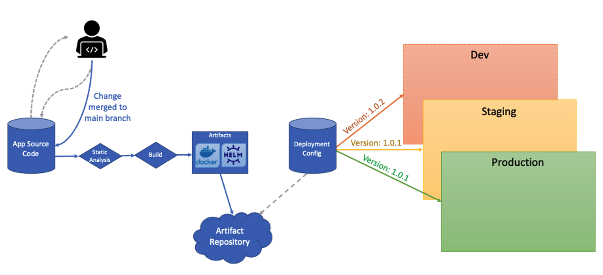

# Outshift Platform Demo <!-- omit in TOC -->

This is a "demo" application source code repository. 

It is a concrete implementation of a simple "Hello World" application designed to demonstrate the CI/CD pipeline for an application deployed to the ET&I Platform's [Shared Kubernetes Cluster](https://wwwin-github.cisco.com/eti/eti-platform-docs/blob/main/architecture/eti-shared-k8s/README.md).

## [Click here for a quick start to create your own demo app](https://wwwin-github.cisco.com/pages/eti/eti-platform-docs/services/helloworld-apps/platform-demo/user-guide/create-new-python-demo)

💡 Please watch the [open-mic demo](https://sharevideo.cisco.com/#/videos/5b2fe4ee-caa2-4df5-9114-5f181fc1ecfb) for detailed explained of this demo

## Overview

This repository was created to demonstrate a basic application source code repository that integrates with the [ETI Platform's CI/CD pipeline](https://wwwin-github.cisco.com/eti/eti-platform-docs/blob/main/guides/ci_cd/main.md). In accordance with the ["build, release, run" principle of Twelve-Factor Apps](https://12factor.net/build-release-run), Continuous Integration (i.e, "build" stage) is decoupled from Continuous Deployment (i.e., "release" phase).

The CI pipeline builds two immutable artifacts from the application source code repo: the Docker image and Helm Chart that enables the application to run as a containerized service in a Kubernetes environment. A _separate_  repository manages deployment-related details, such as environment-specfic application configuration, which includes the version of the application to deploy to a specific environment. The diagram below summarizes the CI/CD pipeline:



## Monitoring

This demo application includes example implementations of a health endpoint, kubernetes liveness and readiness probes, and prometheus client instrumentation to emit health metrics for itself and its dependencies.

>**Note**: Since this is a _demo_ app, the "dependencies" it checks are actually _mock_ services (a `db` database and an upstream service named `foo`) implemented in `mock_services.py` to simulate responses with configurable reliability (`MOCK_DB_UPTIME` and `MOCK_FOO_UPTIME` in Helm values). I.e., `mock_services.py` is a utility module, _not_ part of the implementation examples.

### Health Check and Metrics

This demo app implements health checks that evaluates whether it is able to meet is functional requirements, i.e., whether it is in a "healthy state."

#### Service States

Since services can be in "degraded" state, in addition to a clear "up" or "down" state, the following service states are defined in `health_check.py`:

```python
class HealthState(Enum):
    UP = 0
    UNKNOWN = 1
    DEGRADED = 2
    DOWN = 3
```

#### Health Check Types

A service often relies on other upstream services, such as databases or third-party services to successfully execute its function. Therefore, its own service health is tied to the health of such upstream dependencies. To distinguish the level of impact a down dependency may have on the service, the following types of dependencies are defined in `health_check.py`:

```python
class HealthCheckType(Enum):
    SELF = 0
    UNKNOWN = 1
    DEPENDENCY_OPTIONAL = 2
    DEPENDENCY_CRITICAL = 3
```

* `SELF`: denotes that this health check captures the overall state of this service
* `UNKNOWN`: a dependency whose full impact on this service is not fully understood
* `DEPENDENCY_OPTIONAL`: a dependency that only impacts minor/non-critical functionalities of this service
* `DEPENDENCY_CRITICAL`: a dependency that impacts major/critical functionalities of this service

These types can be used to label health metrics to enable filtering those metrics by service impact.

#### Health Check Implementation

The platform-demo app includes an example implementation of its service health check in `health_check.py`, where it:

* Verifies the state of its (mock) dependencies (please read the [**Note**](#monitoring) about the mocked dependencies)
    * `db` - a database that is critical for `platform-demo` to function
    * `foo` - an upstream service that is optional `platform-demo` for this service
* Determines is own health, factoring in the health and criticality of its dependencies
* Instruments the health check invocation logic to capture the result and execution duration as Prometheus metrics
    * These metrics include the following labels:
        * `service_name` - name of the service conducting these health checks (i.e., `platform-demo`)
        * `health_check_type` - one the types described in [Health Check Types](#health-check-types)
        * `health_check_name` - name of the service being evaluated by this check (e.g., `db`, `foo`, `platform-demo`)
    * Consistent label attributes will help with correlating metrics across multiple services and dependencies when troubleshooting issues

### Health Endpoint

The `/healthz` endpoint shows the current state of the service, as determined by its health check implemented in `health_check.py`. The current health state of this service is returned as a JSON response:

```
{
  "service_name": "platform-demo",
  "service_state": "UP",
  "last_updated": "2022-11-01T18:10:22.462197"
}
```

This endpoint can be used for both k8s liveness probes and external monitoring tools, such as ThousandEyes.

### Kubernetes Probes

The Helm Chart for this application specifies Kubernetes [liveness and readiness probes](https://kubernetes.io/docs/tasks/configure-pod-container/configure-liveness-readiness-startup-probes/) in `deploy/platform-demo/templates/deployment.yaml`.

#### Liveness Probe

The liveness probe is pointed at the `/healthz` endpoint. This endpoint is implemented to return status code `200` to signal that the service is up or degraded (i.e., that restarting the service is not needed) and `500` to signal that the service is down or in an unknown state (i.e., that restarting the service may help to recover the service). 
This logic is not foolproof (if the service is down because the database is down, restarting the service without restoring the database will not recover the service). Every service will have its own set of conditions for responding with the appropriate signal to these probes.

#### Readiness Probe

The readiness probe is pointed at the root endpoint, `/` to signal that it is able to serve traffic if that endpoint responds successfully with a `2xx` or `3xx` status code.
