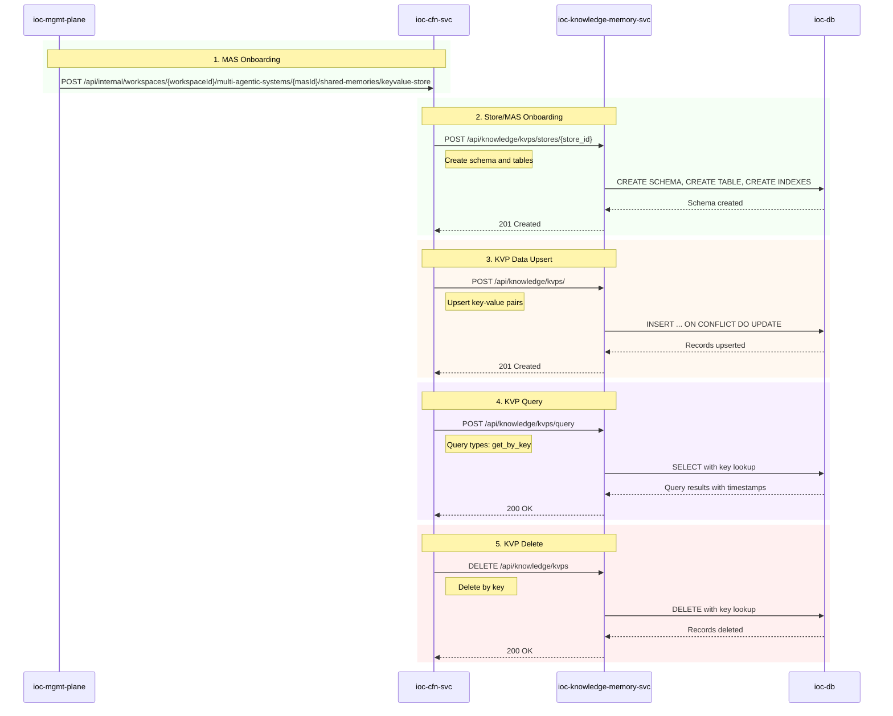
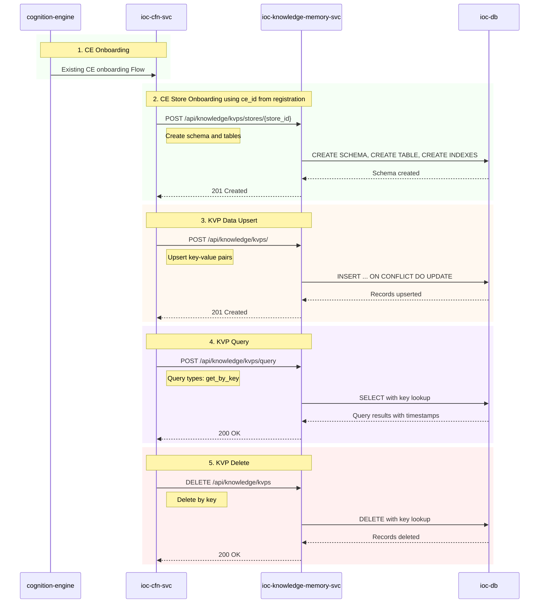

# Knowledge KeyValue Store API Sequence Diagrams

## MAS Scoped Key Value Store

## Cognition Engine Scoped Key Value Store

## API Endpoints

Refer to openapi-spec.yaml for all supported APIs and their details.