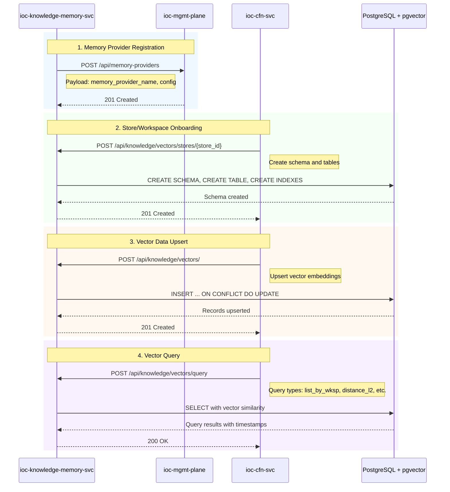

# Knowledge Vector API Sequence Diagram

```mermaid
sequenceDiagram
    participant IOCMS as ioc-knowledge-memory-svc
    participant IOCMP as ioc-mgmt-plane
    participant IOCCFN as ioc-cfn-svc
    participant DB as PostgreSQL + pgvector

    %% 1. Service Registration
    rect rgb(240, 248, 255)
        Note over IOCMS, IOCMP: 1. Memory Provider Registration
        IOCMS->>IOCMP: POST /api/memory-providers
        Note right of IOCMS: Payload: memory_provider_name, config
        IOCMP-->>IOCMS: 201 Created
    end

    %% 2. Onboarding
    rect rgb(245, 255, 245)
        Note over IOCCFN, IOCMS: 2. Store/Workspace Onboarding
        IOCCFN->>IOCMS: POST /api/knowledge/vectors/stores/{store_id}
        Note right of IOCCFN: Create schema and tables
        IOCMS->>DB: CREATE SCHEMA, CREATE TABLE, CREATE INDEXES
        DB-->>IOCMS: Schema created
        IOCMS-->>IOCCFN: 201 Created
    end

    %% 3. Data Upsert
    rect rgb(255, 248, 240)
        Note over IOCCFN, IOCMS: 3. Vector Data Upsert
        IOCCFN->>IOCMS: POST /api/knowledge/vectors/
        Note right of IOCCFN: Upsert vector embeddings
        IOCMS->>DB: INSERT ... ON CONFLICT DO UPDATE
        DB-->>IOCMS: Records upserted
        IOCMS-->>IOCCFN: 201 Created
    end

    %% 4. Query Operations
    rect rgb(248, 240, 255)
        Note over IOCCFN, IOCMS: 4. Vector Query
        IOCCFN->>IOCMS: POST /api/knowledge/vectors/query
        Note right of IOCCFN: Query types: list_by_wksp, distance_l2, etc.
        IOCMS->>DB: SELECT with vector similarity
        DB-->>IOCMS: Query results with timestamps
        IOCMS-->>IOCCFN: 200 OK
    end
```

## API Endpoints

Refer to openapi-spec.yaml for all supported APIs and their details.